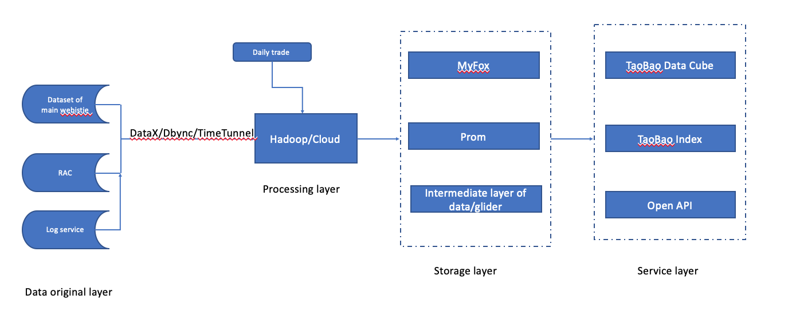
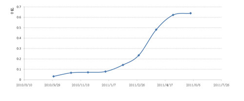
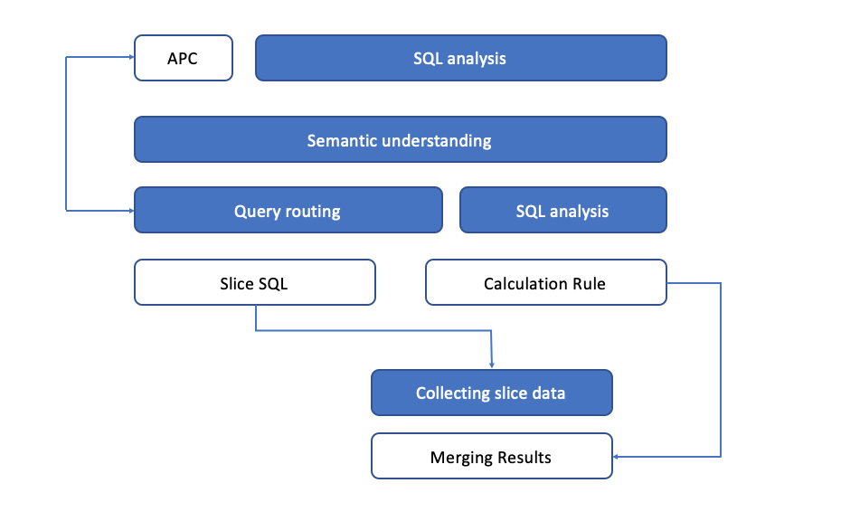
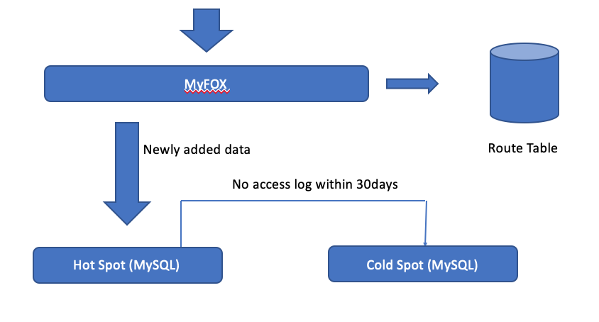

# Description of one Big Data problem for HW1
## 1. Outline
> I once i read an online article, which is about the TaoBao Data magic cube. This is a tool once provided by TaoBao for users to get some useful informations from data collected by TaoBao platform, the data including daily trade, price of product, trading volume, etc. Based on their official document, this tool could provide macro situation of the industry, marktet situation of specific brand and consumer behavior by analyzing previous collected data. Beside it could also collaborate with other researche institution to provide specific service for business company.
## 2. Problem description
>The data generated by the TaoBao platform was about 7000gb during that period, processing such a huge volume of data generated by different consumers and sellers is a big challenge. Beside how to analyze these data and conclude useful information for users is also difficult, so this kind of tool, which uses bigdata analysis, is very powerful.
## 3. workflow

### Data Collection
>According to the flow of data,  we can divide the technical architecture of Taobao data products into five layers, namely data source, computing layer, storage layer, query layer and product layer. At the top of the architecture is our data source layer, where there are databases of Taobao's users, stores, commodities and transactions, as well as user browsing, search and other behavior logs. This series of data is the most original vitality of data products.
>Because the data can not be completely analyzed by the traditional log file based on HTTP server, because the movement of the user's mouse does not result in the modification of the log file. New processing method: the log collection work is generally executed by a small JavaScript script embedded in the HTML document of the page. When the script is executed by the client browser, when the user's event occurs, the JavaScript script will be triggered to execute. 
>When the collection script is executed, a log request will be sent to the log server. In most cases, the script is executed immediately after the event occurs, but in some cases, it is delayed. The collected information is usually placed in the HTTP request line as URL parameters and sent to the log server for processing. 
>After receiving the log request from the client, the log server will send a response to the browser to avoid that the browser of the client is in an unsuccessful state. At the same time, the log server writes the data to the buffer to complete the collection.
>The data entering the buffer will be read out by the log processing program, analysed, and transferred to the standard log file after processing. Through message middleware, the data is sent to real-time or offline big data analysis tools.

### Data Processing
>The real-time data generated in the data source layer is transmitted to a Hadoop cluster with 1500 nodes through the data transmission components dataX, dbsync and timetunnel, which are independently developed by TaoBao. This cluster, which we call "ladder", is the main component of the computing layer. We have about 40000 threads every day to do different MapReduce calculations for 1.5pb of raw data according to product requirements. At present, about 80% of Taobao's MapReduce is based on hive's HQL, and the IDE tool is implemented, with high development efficiency. The rest of the complex statistics is real MapReduce.

### Data Storage
>In this layer, the platform has MySQL based distributed relational database cluster MyFox and HBase based NoSQL storage cluster prom. In addition, other third-party modules are also included in the scope of storage layer.The increase of heterogeneous modules in the storage layer has brought challenges to the use of front-end products. For this reason, it has a general data middle layer, glider, to shield this effect. Glider provides restful interface with HTTP protocol. The data product can get the data it wants through a unique URL. Taobao data products choose MySQL's MyISAM engine as the underlying data storage engine. On this basis, in order to deal with the massive data, it designed the query agent layer MyFox of the distributed MySQL Cluster, which makes the partition transparent to the front-end application. At that time, the statistical data stored in MyFox has reached 10TB, accounting for more than 95% of the total data volume of data cube, and is growing by more than 600 million every day. These data are distributed approximately evenly to 20 MySQL nodes. When querying, the data is transparently served through MyFox. Not all of MyFox's 20 existing nodes are "equal.". Generally speaking, users of data products are more concerned with the data of "recent days". The earlier the data, the easier it is to be ignored. Therefore, for the sake of hardware cost, it divided the 20 nodes into "hot node" and "cold node"

